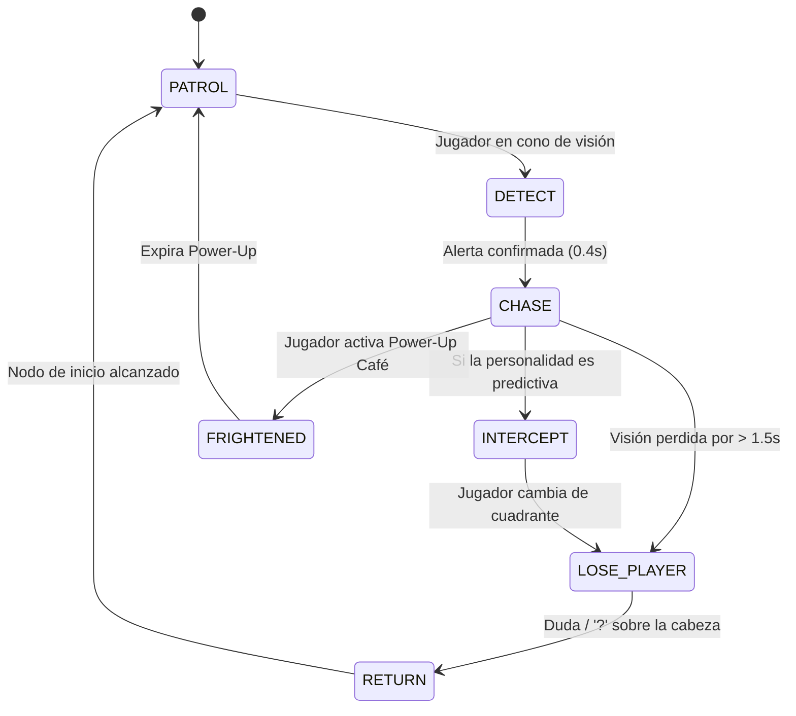

# Diseño de Inteligencia Artificial de Enemigos (AI Design)

## 1. Principio Fundamental: Decisiones en Intersecciones
> **"No calculamos Dijkstra cada fotograma. La IA evalúa y toma decisiones exclusivamente al alcanzar un nodo de intersección o al ocurrir una transición de estado."**

Entre nodo y nodo, los enemigos se mueven con trayectoria recta o curva a lo largo de la arista actual. Esto reduce el consumo de CPU al mínimo ($< 0.1\text{ms}$ por frame) y reproduce con fidelidad la tensión clásica de los laberintos arcade donde el jugador puede leer y anticipar los giros en los cruces.

---

## 2. Máquina de Estados Finita (FSM)

- **`PATROL`:** El enemigo recorre su circuito asignado a velocidad de exploración ($65\%$ de la velocidad del jugador).
- **`DETECT`:** Pausa breve de $0.3 - 0.4\text{s}$ con icono de exclamación `!` al detectar al estudiante.
- **`CHASE`:** Movimiento a velocidad completa ($95\% - 105\%$ de la velocidad del jugador) eligiendo aristas que minimizan la distancia al objetivo.
- **`INTERCEPT`:** Apunta al nodo proyectado adelante del estudiante en lugar de su nodo actual.
- **`LOSE_PLAYER`:** Breve desconcierto con icono `?` al doblar esquinas o perder línea de visión.
- **`RETURN`:** Regreso calmo a su estación de origen.
- **`FRIGHTENED` (Modo Miedo / Reversa):** Al consumir el café de Shillers, los enemigos invierten su dirección y huyen hacia las esquinas del campus (*Scatter mode*).

---

## 3. Las 4 Personalidades Algorítmicas de Icesi

### 01 — El Monitor Académico (Perseguidor Directo)
- **Inspiración:** *Blinky (Shadow)*
- **Comportamiento en Intersección:**
  - Evalúa todas las aristas salientes del nodo actual (excepto por la que acaba de venir para evitar oscilación de 180°).
  - Selecciona la arista cuyo nodo final tiene la **menor distancia euclidiana directa** hacia el nodo actual del jugador:
    $$\text{Target} = \text{Node}_{\text{Player}}$$
- **Sensación:** Presión constante en línea recta por la espalda. No se distrae.

### 02 — El Vigilante del Campus (Patrullero de Rutas)
- **Inspiración:** *Inky (Bashful)*
- **Comportamiento en Intersección:**
  - Posee una lista fija de nodos en bucle cerrado: $[N_1 \to N_2 \to \dots \to N_k \to N_1]$.
  - En cada cruce, toma la arista que conduce al siguiente nodo de su ruta de patrulla.
  - **Excepción de Intercepción:** Si el jugador atraviesa el cono frontal de su faro ($60^\circ$, $8\text{ metros}$), el vigilante suspende la patrulla por $4\text{ segundos}$ para perseguirlo antes de reanudar su circuito.
- **Sensación:** Amenaza rítmica y metronómica. El jugador experto aprende sus horarios y se cuela detrás de su carrito.

### 03 — La Entrega / El Parcial Sorpresa (Emboscador Predictivo)
- **Inspiración:** *Pinky (Speedy)*
- **Comportamiento en Intersección:**
  - Proyecta la posición del estudiante a futuro evaluando su vector de velocidad actual $\vec{v}_{\text{Player}}$:
    $$\text{Target} = \text{Node}_{\text{Player}} + 4 \times \vec{v}_{\text{Player}}$$
  - En cada intersección, elige la arista que lo aproxima a ese punto de corte.
- **Sensación:** Muy inteligente y peligroso. Corta esquinas e intercepta al jugador de frente en los pasillos de la Biblioteca.

### 04 — El Caos / La Iguana de Pance (Flanqueador Estocástico)
- **Inspiración:** *Clyde (Pokey)*
- **Comportamiento en Intersección:**
  - Si la distancia al jugador es $\ge 6\text{ metros}$: se comporta de forma errática mediante selección ponderada aleatoria de aristas (`RandomWeighted`).
  - Si la distancia al jugador es $< 6\text{ metros}$: se asusta o bloquea el corredor, eligiendo una arista de escape hacia el Samán o la zona verde más cercana.
- **Sensación:** Introduce dinamismo no determinista. Rompe las rutas optimizadas y genera momentos emergentes.
