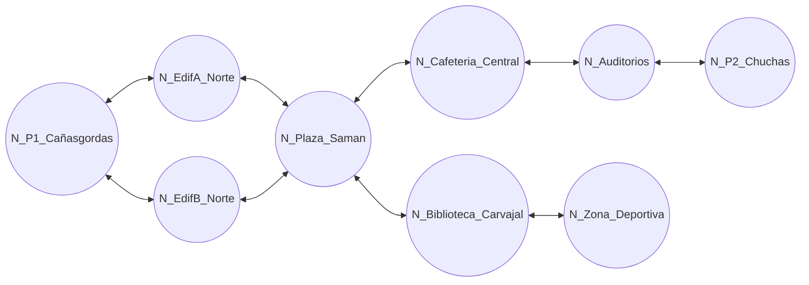

# Especificación del Grafo de Circulación del Campus (Campus Graph Spec)

## 1. Topología del Grafo de Icesi

El campus se abstrae como un grafo no dirigido ponderado $G = (V, E)$, donde los vértices $V$ representan cruces peatonales o puntos de interés y las aristas $E$ representan los corredores navegables.



---

## 2. Definición Estructural de Nodos ($V$)

Cada nodo almacena metadatos topológicos y semánticos:
```json
{
  "id": "node_saman_center",
  "worldPosition": { "x": 16.5, "y": 10.5 },
  "zoneId": "plaza_saman",
  "connectedEdges": ["edge_na_saman", "edge_nb_saman", "edge_saman_lib", "edge_saman_caf"],
  "nodeType": "INTERSECTION",
  "tags": ["landmark", "open_plaza", "iguana_habitat"]
}
```

### Tipos de Nodos (`nodeType`):
- `INTERSECTION`: Cruce de 3 o más corredores (puntos de decisión de IA y asistencia de giro del jugador).
- `CORNER`: Giro obligatorio de 90 grados.
- `DEAD_END`: Final de corredor o interior de salón/oficina.
- `SPAWN_POINT`: Punto de inicio de entidades (`spawn_player`, `spawn_vigilante`, `spawn_monitor`).
- `PORTAL_EXIT`: Puntos de escape del campus (`gate_1`, `gate_2`, `gate_3`, `gate_4`).

---

## 3. Definición Estructural de Aristas ($E$)

Cada arista conecta dos nodos y define las características físicas del corredor:
```json
{
  "id": "edge_saman_lib",
  "nodeA": "node_saman_center",
  "nodeB": "node_lib_entrance",
  "lengthMeters": 18.5,
  "corridorWidthMeters": 2.5,
  "isBlocked": false,
  "surfaceType": "TILED_WALKWAY",
  "speedMultiplier": 1.0,
  "allowedDirections": "BIDIRECTIONAL"
}
```

---

## 4. Zonas Semánticas y Puntos Especiales

| Zona | ID Semántico | Nodos Clave | Puntos Especiales | Perfil de Peligro |
| :--- | :--- | :--- | :--- | :--- |
| **Acceso Norte** | `north_gate` | `N_P1_Cañasgordas`, `N_Bulevar_N` | `spawn_player` | 0.1 (Bajo) |
| **Edificio A** | `edificio_a` | `N_EdifA_Norte`, `N_EdifA_Sur` | `item_project`, `ambush_monitor` | 0.6 (Medio-Alto) |
| **Plaza del Samán**| `plaza_saman`| `N_Plaza_Saman`, `N_Saman_East` | `iguana_territory`, `landmark_tree` | 0.3 (Abierto) |
| **Biblioteca** | `biblioteca` | `N_Biblioteca_Carvajal` | `item_book`, `safe_zone` | 0.2 (Zona Silencio) |
| **Cafetería** | `cafeteria` | `N_Cafeteria_Central` | `powerup_coffee`, `recovery_zone` | 0.5 (Tráfico Alto) |
| **Auditorios** | `auditorios` | `N_Auditorios` | `chase_corridor` | 0.7 (Estrecho) |
| **Portería 2** | `porteria_2` | `N_P2_Chuchas` | `exit_portal`, `emergency_gate` | 0.9 (Cierre Crítico) |

---

## 5. Validación Automatizada del Grafo (`MapValidator`)

El editor en Unity ejecutará pruebas estáticas para garantizar integridad del laberinto:
1. **Conectividad Total:** Desde `spawn_player`, debe existir al menos una ruta válida hacia cada ítem de misión y hacia cada salida de escape.
2. **Sin Nodos Huérfanos:** Ningún nodo puede tener `connectedEdges.Count == 0`.
3. **Ancho Mínimo de Corredor:** Toda arista debe tener un ancho mínimo $\ge 1.5\text{ metros}$ para garantizar la maniobrabilidad del jugador.
